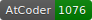

# elzup's Competitive Programming Workspace

[](https://atcoder.jp/users/anozon)


## Language

https://atcoder.jp/users/anozon

- JavaScript, TypeScript(2019-8\~)

  - AtCoder: 910

- Java, Python(2016-7\~2019-12)

  - AtCoder: 1383

### template config

check template directory

```
acc config-dir
```

```
# update template for me
cp template.ts `acc config-dir`/ts/main.ts
```

## Used

- [Tatamo/atcoder\-cli](https://github.com/Tatamo/atcoder-cli)
- [kmyk/online\-judge\-tools](https://github.com/kmyk/online-judge-tools)
